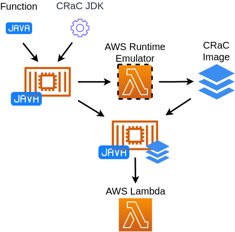

# AWS Lambda on Java with CRaC

This is an example of a Java AWS Lambda that uses Project CRaC to reduce the cost and time of the first function invocation.

Based on https://github.com/awsdocs/aws-lambda-developer-guide/tree/main/sample-apps/blank-java.

In this example the function will be packed as the [container image](https://docs.aws.amazon.com/lambda/latest/dg/gettingstarted-images.html#gettingstarted-images-package) together with JDK CRaC runtime and the CRaC image.

The CRaC image with the snapshot of JVM and application states will be preparied with the help of [AWS Runtime Interface Emulator](https://github.com/aws/aws-lambda-runtime-interface-emulator).

The deployment scheme will be:
* Create the container image with the function
* Create the CRaC image:
  * Run the function in the local environment
  * Optionally, warm-up the function
  * Trigger checkpoint to dump the image
* Create the container image with the function and the image
* Deploy the container to AWS



* [Instruction](#instruction)
  * [Build](#build)
  * [Checkpoint](#checkpoint)
  * [Deploy](#deploy)
    * [Test locally](#test-locally)
    * [Deploy to AWS](#deploy-to-aws)
* [Techical details](#techical-details)

## Instruction

The repo contain a helper script to perform routine operations.
It is intended to be "executable documentation", so the reader is invited to look to the script

The step zero fetches necessary dependencies:

```
./crac-steps.sh s00_init
```

It will be required to download the latest development build of OpenJDK CRaC from https://github.com/CRaC/openjdk-builds/actions/workflows/release.yml. Then run:

```
./crac-steps.sh dojlink ./path/to/the/extracted/crac/jdk
```

### Build

The function needs to use a fork of [AWS Lambda Java Libraries](https://github.com/CRaC/aws-lambda-java-libs), `pom.xml` was changed to:

```
    <dependency>
      <groupId>io.github.crac.com.amazonaws</groupId>
      <artifactId>aws-lambda-java-runtime-interface-client</artifactId>
      <version>1.0.0</version>
    </dependency>
```

Build the app and create the container image for checkpoint (`crac-lambda-checkpoint`):
```
./crac-steps.sh s01_build
```

### Checkpoint

Run the container for checkpoint on the local machine:

```
./crac-steps.sh s02_start_checkpoint
```

At this point you may provide a workload to warm-up your function, served on port `8080`.

Then trigger checkpoint from another terminal:
```
./crac-steps.sh s03_checkpoint
```

The former function process should exit, leaving the CRaC image in the `cr` directory.

Create the final container image with the CRaC image (`crac-lambda-restore`):

```
./crac-steps.sh s04_prepare_restore
```

### Deploy

Now you can deploy `crac-lambda-restore` as the container function to the AWS.

You may also check the function locally with RIE.

#### Test locally

You can also test the container locally:

```
./crac-steps.sh s05_local_restore
```

From another terminal:
```
./crac-steps.sh post hi
```

To test cold start, drop file system caches by:
```
./crac-steps.sh make_cold_local
```

#### Deploy to AWS

The helper script can deploy the container, assuming there is a function named `crac-test` configured to use image `crac-test`.

Initialize the evironment:
```
eval $(./crac-steps.sh s06_init_aws)
```

Push the container and update the function:
```
./crac-steps.sh s07_deploy_aws
```

To test cold start, reconfigure the function by:
```
./crac-steps.sh make_cold_aws
```

## Techical details

AWS environment restricts features and capabilities for functions in containers:
* the file system is read-only, except `/tmp`
* setting PID/TIDs for being restored process, `ptrace`, and some other syscalls that are usually required by CRIU are not allowed
* storage performance is not great

To overcome storage limits we unpack libjvm.so to /tmp at the start of the container.
Same is done for CRaC image after it's added to the container image.

CRaC's build of CRIU attempts to set the PID/TIDs on restore first, in case this functionality is presented.
When this fails in AWS, it attempts to align the next PID by creating empty do-nothing processes/threads. 
As in the vanilla CRIU, there is strict requirement for PID/TIDs to be available.
To ensure Java PID/TIDs won't intersect with another processes on restore, checkpoint script ensures Java PID/TIDs are created with a reasonable offset, see [the script](./checkpoint.cmd.sh#L8).
